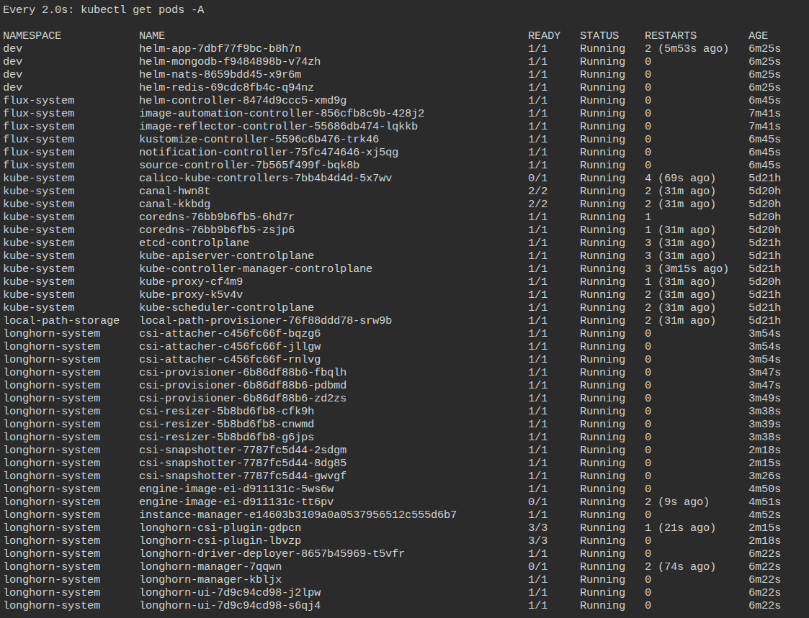

# .NET Service Example - Assignment
## Overview
DevOps and automation best practices for a simple .NET application covering tasks below:
| Task | Objective | Solution |
|:---:|:---:|:---:|
| Local Demo | Application deployment and structure review | Vagrant |
| Public repository | Public Git repository | GitHub |
| Secrets | Avoid exposing secrets | GitHub secrets + Azure Key Vault |
| CI | Automated tests, Build, Publish Docker image | GitHub Actions |
| Orchestration | Managing containers | K8s |
| Orchestration versioning | Application helm chart  | Helm |
| Monitoring stack | Monitoring throw GitOps | kube-prometheus-stack |
| Storage solution | Storage solution via GitOps | Longhorn |

---
## Project tree:
``` bash
.
├── app # .Net applciation, docker image, etc
├── assets # Some images as the references for the README.md
├── gitops # CD and deployment automation >>> using FluxCD
├── helm # Helm chart >>> published
├── infra # IaC using Terraform for production level and cloud-native deployment
├── README.md
└── sandbox # Simple demo and sandbox with IaC using Vagrant
```
---
## Docker Compose Local Demo
For the local deployment you can simply use **Vagrant** as a local development environment. For this purpose, first of all find the **/sandbox/Vagrantfile** and uncomment lines 51-65:
<p align="center">
  
</p>

Then you can use the commands below to bootstrap the instance and have the application directory as a synced folder:
``` bash
vagrant up demo
vagrant ssh demo
```
**Notice:** After project demo make sure to comment those lines again and destroy the demo instance:
``` bash
vagrant destroy demo
```
---
## Public repository
<p align="center">
  
</p>
For this demonstration, GitHub has been used as a public Git repository, and GitHub Actions as the CI/CD tool.

### Semantic versioning
The application code is being stored using ***Semantic Versioning*** standard and the **/.github/workflows/ci.yml** file contains a conditional state for the Docker image build and push that runs only when there is a valid semantic tag **(e.g v1.0.0)** and the push is on the **main** branch.

---
## Secrets
In this repository, secrets have been handled using **Azure Key Vault** as the primary secret management vault, and the **GitHub secrets** to store the Azure credentials. 

---

## CI pipeline
The CI pipeline which can be found in the **/.github/workflows/ci.yml** includes jobs below:
- **Build and test** - Check out the repository ```>```  install the .NET environment and get the runner ready for tests ```>```  build the application ```>```  do tests using the command ```dotnet test```
- **Docker Image** - Runs only when there is a push on the main branch and there is a valid semantic tag ```>```  check out the repository ```>``` fetch secrets from Azure Key Vault ```>``` extract the semantic tag ```>``` build the Docker image using the semantic tag and push to the [***Dockerhub***](https://hub.docker.com/repository/docker/sepehrmdn/mirasys-assignment/general)

***Notice:*** For more information please check the [**ci.yaml**](https://github.com/sepehrmdn77/mirasys-assignment/blob/main/.github/workflows/ci.yml) file.

---
## Helm
The ServiceExample application is completely packaged as a Helm chart including:
1. The **ServiceExample** application
2. **MongoDB**, **Nats**, and the **Redis** in the [/helm/templates/](https://github.com/sepehrmdn77/mirasys-assignment/tree/main/helm/templates)

And it is available on the **ArtifactHub**, it can be deployed using following commands below (***it is not an umbrella chart and would deploy everything on a single chart***):
``` bash
helm repo add mirasys-chart https://sepehrmdn77.github.io
helm repo update
helm install <release-name> mirasys-chart/helm --namespace dev --create-namespace
```


### There are two easy ways to demo the project:
### 1. Local demo
For this purpose follow the instructions below:

``` bash
cd ./sandbox
vagrant up
```
After bootstrapping, a **kubeadm join** command will be available in the ending of the **/home/vagrant/init-output.txt** file. copy it:
``` bash
vagrant ssh master
tail init-output.txt
exit
```
And run it on both worker node as sudo:
``` bash
vagrant ssh worker-1
sudo <join-command>
exit
vagrant ssh worker-2
sudo <join-command>
exit
```
Then you can install the Helm chart using commands upper mentioned.

***Note:*** If you cannot get nodes and fetch pods, your kubectl config files are not copied and served, so make sure to run commands below on the master node:
```bash
rm -rf ~/.kube
sudo mkdir -p $HOME/.kube
sudo cp -i /etc/kubernetes/admin.conf $HOME/.kube/config
sudo chown $(id -u):$(id -g) $HOME/.kube/config
```
### 2. Online playground
There would be another easier way to demo the project, you can find the K8s playground in the link below:
``` link
https://killercoda.com/playgrounds/course/kubernetes-playgrounds
```
There are several cluster set-ups (Free and Premium) to demo the project.

## CD \& GitOps - (researched)
**GitOps tree:**
``` bash
gitops
├── gitops/clusters # Dev cluster containing the main application
├── gitops/flux-system # Flux made commit for the desire stat
├── gitops/imagepolicy.yaml # Image auto update policy
├── gitops/imagerepo.yaml # Image auto update policy
├── gitops/imageupdate.yaml # Image auto update policy
├── gitops/infrastructure # Namespaces, monitoring stack, and storage
└── gitops/kustomization.yaml # root kustomization file
```
As the Continuous Deployment stack, here we have used **FluxCD** as the GitOps tool and **Loghorn** is present as the storage solution.
**Prometheus + Grafana stack** is deployed using **kube-prometheus-stack** Helm chart via GitOps:
``` link
gitops/infrastructure/monitoring/helmrelease-monitoring.yaml
```
Notice that for the GitOps deployment, all we have to do is to provide GitHub token (for priavte repositories), GitHub user, and the repository, then the GitOps can simply be deployed on the master node by running the commands below:
``` bash
curl -s https://fluxcd.io/install.sh | sudo bash
flux install --components=image-reflector-controller,image-automation-controller

export GITHUB_USER='<github_username>'
export GITHUB_TOKEN='<classic_token>'
export GITHUB_REPO='<repo_name>'

flux bootstrap github \
  --owner="$GITHUB_USER" \
  --repository="$GITHUB_REPO" \
  --path="./gitops" \
  --personal \
  --branch=main
```
Through running these commands you are doing these steps:
1. Installing FluxCD
2. installing image-automation-controller - For auto image updates
3. Bootsrapping the cluster using FluxCD and complete GitOps

And for the health check you can check if **git repository** added using command below:
``` bash
kubectl get gitrepository -A
```
Also you can check **kustomization** status:
``` bash
kubectl get kustomization -A
```
Application release healt hcheck:
``` bash
flux get helmrelease -A
flux get sources helm -A
```

The GitOps process will deploy an storage system using **longhorn**, and a complete monitoring stack using **kube-prometheus-stack**.
The monitoring stack can be modified via accessing the Prometheus, and it gathers common metrics such as kubeapi, etc.

The Visualization panel can be accessed using command below:
``` bash
kubectl -n monitoring port-forward svc kube-prometheus-stack-grafana 3000:80
```
From this point, the FluxCD will do the GitOps operation and is listening to your repository for any changes.


After bootstrapping the FluxCD you're going to have the cluster below:
<p align="center">
  
</p>

### App auto deployment (image automation):
As it was mentioned before the CRD would be installing using the command:
``` bash
flux install --components=image-reflector-controller,image-automation-controller
```
After installation,the **image automation** would be started automaticaly according the files below:

[**/gitops/imagepolicy.yaml**](https://github.com/sepehrmdn77/mirasys-assignment/blob/main/gitops/imagepolicy.yaml)

[**/gitops/imagerepo.yaml**](https://github.com/sepehrmdn77/mirasys-assignment/blob/main/gitops/imagerepo.yaml)

[**/gitops/imageupdate.yaml**](https://github.com/sepehrmdn77/mirasys-assignment/blob/main/gitops/imageupdate.yaml)

---

## How to Reproduce the Full Cluster - brief steps
``` text
1. Clone repo

2. vagrant up (or a cloud VM bootstrap)

3. kubeadm init

4. kubeadm join

5. flux bootstrap

6. wait for GitOps

7. port-forward grafana

8. see the application deployed automatically
```

---

## Common issues
**Vagrant Network**: If you face a network issue in the **Vagrant** cluster, note to create separate **Vagrantfiles** and different VMs to avoid connectivity issue.
Because a single Vagrantfile uses only one internal IP address for the whole cluster and maybe nodes couldn't talk to eachother after orchestration (regardless of 192.168.X.X ranges).

Also you can modify the kubelet configs available in the ```/etc/systemd/system/kubelet.service.d/10-node-ip.conf``` and make sure it exists and you can find the config file below:
``` bash
[Service]
Environment="KUBELET_EXTRA_ARGS=--node-ip=192.168.56.x" # Modify x
```
After this step, do the same operation on the ```/var/lib/kubelet/kubeadm-flags.env``` file and modify the parameter below:
``` bash
'KUBELET_KUBEADM_ARGS="--container-runtime-endpoint=unix:///var/run/containerd/containerd.sock --pod-infra-container-image=registry.k8s.io/pause:3.9 --node-ip=192.168.56.x"' # Modify x
```

---

# Best to have
The best practice to deploy the complete cluster is to implement the infrastructure as code (**IaC**) using Terraform templates with modular instances to have a reliable and repeatable cloud-native deployment.

The [**/infra**](https://github.com/sepehrmdn77/mirasys-assignment/tree/main/infra) directory includes a basic sample of deploying a simple VM on Azure, simple EC2 instance on AWS, and make them ready to work as a Kubernetes node in which cloud they are implemented in.

***Note:*** After IaC orcehstration please find the ```/etc/systemd/system/kubelet.service.d/10-node-ip.conf``` file and enter your instance IP and the node IP.

Also you can build the whole cluster using **AKS** and **EKS**.

---