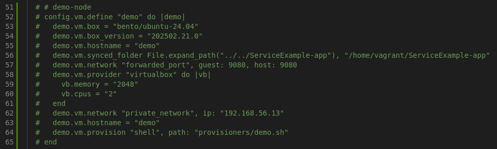

# .NET Service Example - Assignment
## Overview
DevOps and automation best practices for a simple .NET application covering tasks below:
| Task | Objective | Solution |
|:---:|:---:|:---:|
| Local Demo | Application deployment and structure review | Vagrant |
| Public repository | Public Git repository | GitHub |
| Secrets | Avoid exposing secrets | GitHub secrets + Azure Key Vault |
| CI | Automated tests, Build, Publish Docker image | GitHub Actions |
| Orchestration | Managing containers | K8s |
| Orchestration versioning | Application helm chart  | Helm |
| CD & GitOps | Automated image updater and deployment | FluxCD |
---
## Local Demo
For the local deployment you can simply use **Vagrant** as a local development environment. For this purpose, first of all find the **/sandbox/Vagrantfile** and uncomment lines 51-65:
<p align="center">
  
</p>

Then you can use the commands below to bootstrap the instance and have the application directory as a synced folder:
``` bash
vagrant up demo
vagrant ssh demo
```
**Notice:** After project demo make sure to comment those lines again and destroy the demo instance:
``` bash
vagrant destroy demo
```
---
## Public repository
<p align="center">
  
</p>
For this demonstration, GitHub has been used as a public Git repository, and GitHub Actions as the CI/CD tool.

### Semantic versioning
The application code is being stored using ***Semantic Versioning*** standard and the **/.github/workflows/ci.yml** file contains a conditional state for the Docker image build and push that runs only when there is a valid semantic tag **(e.g v1.0.0)** and the push is on the **main** branch.

---
## Secrets
In this repository, secrets have been handled using **Azure Key Vault** as the primary secret management vault, and the **GitHub secrets** to store the Azure credentials. 

---

## CI pipeline
The CI pipeline which can be found in the **/.github/workflows/ci.yml** includes jobs below:
- **Build and test** - Check out the repository ```>```  install the .NET environment and get the runner ready for tests ```>```  build the application ```>```  do tests using the command ```dotnet test```
- **Docker Image** - Runs only when there is a push on the main branch and there is a valid semantic tag ```>```  check out the repository ```>``` fetch secrets from Azure Key Vault ```>``` extract the semantic tag ```>``` build the Docker image using the semantic tag and push to the [***Dockerhub***](https://hub.docker.com/repository/docker/sepehrmdn/mirasys-assignment/general)

***Notice:*** For more information please check the [**ci.yaml**](https://github.com/sepehrmdn77/mirasys-assignment/blob/main/.github/workflows/ci.yml) file.

---
## Helm
The ServiceExample application is completely packaged as a Helm chart and available on the **ArtifactHub**, it can be deployed using following commands below:
``` bash
helm repo add mirasys-chart https://sepehrmdn77.github.io
helm repo update
helm install <release-name> mirasys-chart/helm --namespace dev --create-namespace
```


### There are two easy ways to demo the project:
### 1. Local demo
For this purpose follow the instructions below:

``` bash
cd ./sandbox
vagrant up
```
After bootstrapping, a **kubeadm join** command will be available in the ending of the **/home/vagrant/init-output.txt** file. copy it:
``` bash
vagrant ssh master
tail init-output.txt
exit
```
And run it on both worker node as sudo:
``` bash
vagrant ssh worker-1
sudo <command>
exit
vagrant ssh worker-2
sudo <command>
exit
```
Then you can install the Helm chart using commands upper mentioned.

***Note*** If you cannot get nodes and fetch pods, make sure to run commands below on the master node:
```bash
rm -rf ~/.kube
sudo mkdir -p $HOME/.kube
sudo cp -i /etc/kubernetes/admin.conf $HOME/.kube/config
sudo chown $(id -u):$(id -g) $HOME/.kube/config
```
### 2. Online playground
There would be another easier way to demo the project, you can find the K8s playground in the link below:
``` link
https://killercoda.com/playgrounds/course/kubernetes-playgrounds
```
There are several cluster set-ups (Free and Premium) to demo the project.

## CD \& GitOps - (researched)
As the Continuous Deployment stack, here we have used FluxCD as the GitOps tool.
Prometheus + Grafana stack is deployed using kube-prometheus-stack Helm chart via GitOps:
``` link
gitops/infrastructure/monitoring/helmrelease-monitoring.yaml
```
It can simply be deployed on the master node by running the commands below:
``` bash
curl -s https://fluxcd.io/install.sh | sudo bash

flux bootstrap github \
  --owner=<GITHUB_USER_OR_ORG> \
  --repository=<YOUR_GITOPS_REPO> \
  --path=./gitops/clusters/dev \
  --personal \
  --branch=main
```
The GitOps process will deploy an storage system using **longhorn**, and a complete monitoring stack using **kube-prometheus-stack**.
The monitoring stack can be modified via accessing the Prometheus, and it gathers common metrics such as kubeapi, etc.

The Visualization panel can be accessed using command below:
``` bash
kubectl -n monitoring port-forward svc kube-prometheus-stack-grafana 3000:80
```
## How to Reproduce the Full Cluster - brief steps
``` text
1. Clone repo

2. vagrant up

3. kubeadm init

4. kubeadm join

5. flux bootstrap

6. wait for GitOps

7. port-forward grafana

8. see the application deployed automatically
```
## Common issues
**Vagrant Network**: If you face a network issue in the **Vagrant** cluster, note to create separate **Vagrantfiles** and different VMs to avoid connectivity issue.
Because a single Vagrantfile uses only one internal IP address for the whole cluster and maybe nodes couldn't talk to eachother after orchestration (regardless of 192.168.X.X ranges).

# Best to have
The best practice to deploy the complete cluster is to implement the infrastructure as code (**IaC**) using Terraform templates with modular instances to have a reliable and repeatable cloud-native deployment.

The [**/infra**](https://github.com/sepehrmdn77/mirasys-assignment/tree/main/infra) directory includes a basic sample of deploying a simple VM on Azure, simple EC2 instance on AWS, and make them ready to work as a Kubernetes node in which cloud they are implemented in.

Also you can build the whole cluster using **AKS** and **EKS**.